# Change log
This update highlights support for the new syntax of the Move language

version: v0.5.0

datetime: 2024-04-26

## 1. Use
|  |  |  
| :--: | :--: |  
| before | after |  
| 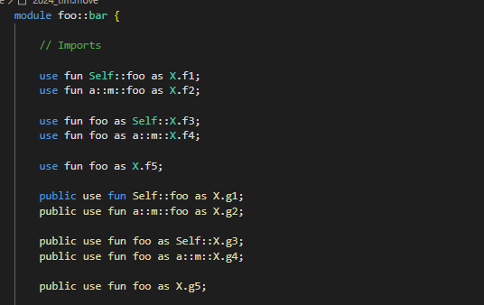 | 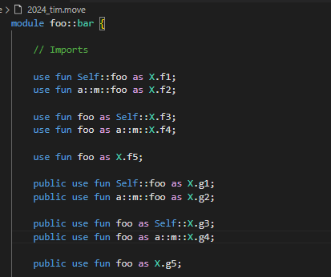 |

## 2. Struct and Ability
|  |  |  
| :--: | :--: |  
| before | after |  
| 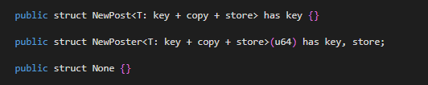 | 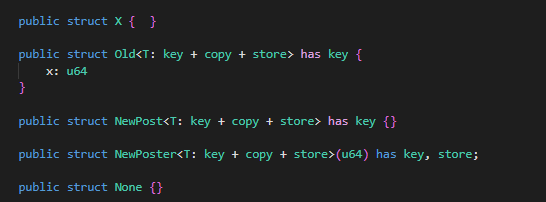 |

## 3. macro fun
|  |  |  
| :--: | :--: |  
| before | after |  
| 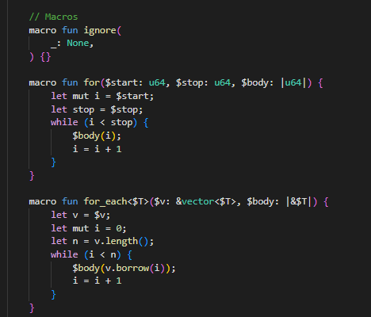 | 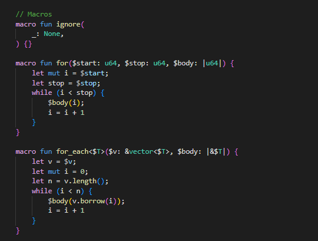 |

## 4. let mut 
|  |  |  
| :--: | :--: |  
| before | after |  
| 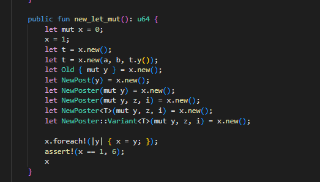 | 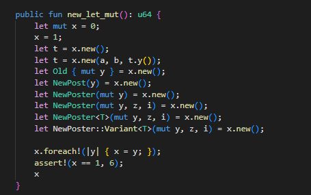 |

## 5. enum
|  |  |  
| :--: | :--: |  
| before | after |  
| 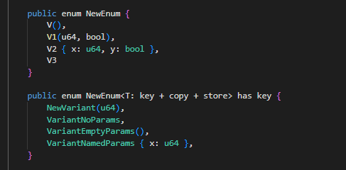 | 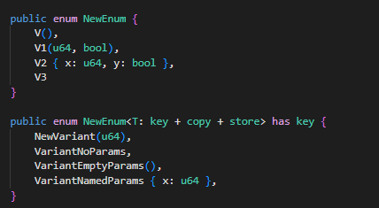 |

## 5. block with 'a
|  |  |  
| :--: | :--: |  
| before | after |  
| 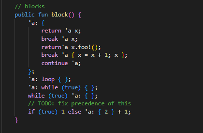 | 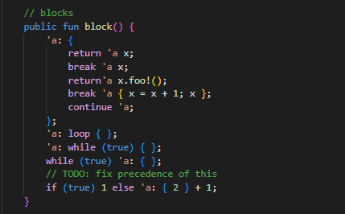 |

## 6. public(package)
|  |  |  
| :--: | :--: |  
| before | after |  
| 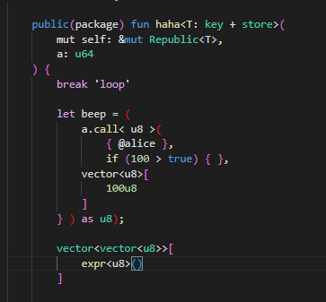 | 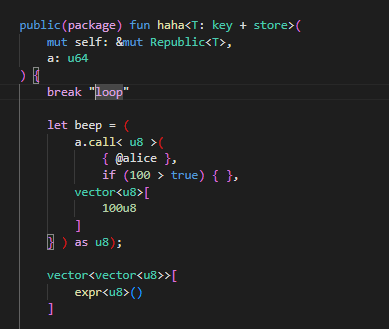 |